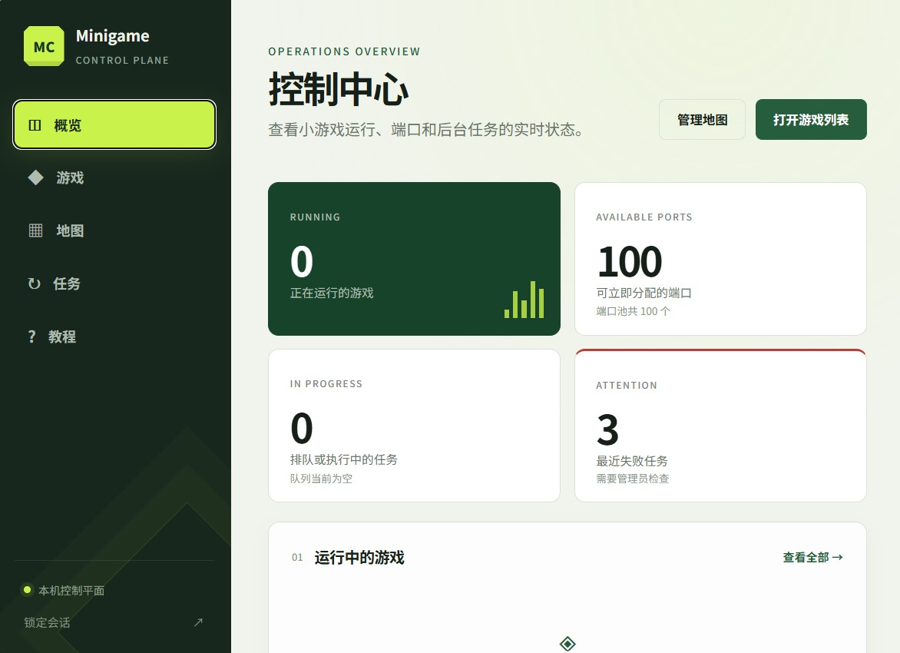

# Minecraft 小游戏管理后端

运行于 Windows WSL2 的 Minecraft 小游戏控制平面，使用 Python、FastAPI、SQLite WAL、rootless Podman、systemd 和全局 frpc。




## 领域模型

- `Map / map_id`：仓库中的不可变模板，来源可以是上传世界或自然生成配置，类似 image。
- `Game / game_id`：从 Map 创建的持久可玩副本，类似带持久卷的 container。
- `Run / run_id`：Game 的一次临时运行，仅供后端内部使用。
- `Backup / backup_id`：Game 内部有限时间线上的恢复点。
- `Task / task_id`：创建、启动、停止、恢复或删除的异步任务。

Map 与 Game 使用不同 ID 空间；API 不公开 `run_id`。

地图可以保存受管的 `server.properties` 默认值；创建 Game 时可以覆盖，并把最终配置固化到
Game。自然生成 Map 不预先创建世界，每个 Game 首次启动 Paper 时独立生成世界；种子留空
表示随机，填写固定种子则可复现。

## 项目目录结构

```text
mc-minigame-manager/
├── .env.example                 # 后端环境变量示例（可提交）
├── config/                      # 当前机器的实际配置入口
│   ├── README.md                # 配置初始化、部署和迁移说明
│   ├── mc-manager.env           # 实际后端配置（生成后被 Git 忽略）
│   └── frpc.toml                # 实际 frpc 配置及 auth.token（被 Git 忽略）
├── deploy/                      # 生产部署模板
│   ├── containers/              # rootless Podman/容器源配置
│   ├── frp/                     # 可提交的 frpc.toml.example
│   ├── sysctl/                  # rootless Podman 所需内核参数
│   ├── systemd/                 # API、Worker、迁移和 frpc 服务单元
│   ├── windows/                 # Windows 任务计划程序启动脚本
│   └── wsl.conf                 # WSL systemd 配置模板
├── docs/                        # 架构文档和从克隆到启用的部署手册
├── frontend/                    # Vue 3 + Vite + TypeScript 管理台
├── migrations/                  # Alembic 数据库迁移
├── scripts/
│   ├── init-config.sh           # 从示例生成项目 config/ 实际配置
│   ├── build-frontend.sh        # 测试、检查并构建生产前端
│   └── install-wsl.sh           # 幂等安装/升级 WSL 生产服务
├── src/mc_manager/
│   ├── app.py                   # FastAPI API、上传和静态前端入口
│   ├── worker.py                # 异步任务 Worker
│   ├── models.py                # SQLAlchemy 数据模型
│   ├── runtime/                 # Podman、Docker 和测试运行时后端
│   ├── services/                # Map、Backup、Paper、端口等领域服务
│   └── static/                  # build-frontend.sh 生成的生产前端
├── tests/                       # 后端 pytest 测试
├── alembic.ini                  # Alembic 配置
└── pyproject.toml               # Python 项目、依赖和质量工具配置
```

`.venv/`、`frontend/node_modules/`、`dist/` 和各类测试/类型检查缓存都是本地生成内容，不属于
项目结构说明。开发默认配置可能按需重新创建项目根目录下的 `var/`；pytest 也可能创建
`tmp/`，二者均被 Git 忽略且不是生产数据。生产数据库与 Map/Game/Backup 分别位于
`/var/lib/mc-manager` 和 `/srv/mc-manager`，不会保存在仓库目录中。

## 开发
```bash
python3.12 -m venv .venv
.venv/bin/python -m pip install --upgrade pip
.venv/bin/pip install -e '.[dev]'
cp .env.example .env
# 开发时设置 MC_RUNTIME_BACKEND=fake
.venv/bin/mc-manager-init
.venv/bin/mc-manager-api
```

另一个终端运行 Worker：
```bash
.venv/bin/mc-manager-worker
```

## 生产配置

示例配置保留在 [.env.example](.env.example) 和
[deploy/frp/frpc.toml.example](deploy/frp/frpc.toml.example)。实际配置不修改示例文件，统一放在
Git 忽略的 `config/` 目录：

```bash
bash scripts/init-config.sh
```

然后直接用 VS Code 编辑：

- `config/mc-manager.env`
- `config/frpc.toml`

frps Token 直接写入 `config/frpc.toml` 的 `auth.token`。该文件与后端环境文件均为 `0600`，
不会被 Git 提交。

运行 `sudo bash scripts/install-wsl.sh` 时，这两个文件会以受限权限部署到
`/opt/mc-manager/config/`，systemd 直接读取部署副本。后续修改仍在项目 `config/` 中进行，
改完重新运行安装脚本同步，无需 `sudoedit`。不直接让 systemd 读取用户 Home 下的项目文件，
因为服务启用了 `ProtectHome=true`，且生产服务不应信任普通用户可随时改写的密钥文件。

旧版安装若仍使用 `/etc/mc-manager` 和 `/etc/frp`，不要提前运行初始化脚本覆盖迁移机会；
先运行 `bash scripts/build-frontend.sh`，再运行新版安装脚本，脚本会将旧配置迁移到项目
`config/`。

前端开发使用 Node.js 26：
```bash
cd frontend
npm install
npm run dev
```

Vite 开发服务器将 `/api` 和 `/healthz` 转发到本机 FastAPI。生产构建由 FastAPI 直接托管，不需要 Caddy：
```bash
bash scripts/build-frontend.sh
```

脚本要求 Node.js 26 和 npm 11+，依赖锁文件及 Node/npm 版本未变化时跳过 `npm ci`，随后
自动执行前端测试、类型检查和生产构建。结果写入 `src/mc_manager/static/`，再安装或部署
Python 包即可。

若地图需要向玩家下发客户端资源包，在环境文件中配置玩家可访问的 HTTP(S) 根地址：

```text
MC_RESOURCE_PACK_BASE_URL=https://packs.example.com
```

上传 Map 时单独选择一个资源包 ZIP。系统会验证根级 `pack.mcmeta`，计算 SHA-1，写入 `server.properties`，并通过无需管理 Token 的 `/resource-packs/` 路由提供下载。Paper 负责通知客户端，不负责托管本地文件；公网地址必须通过 FRP 或已有 HTTPS 反向代理到达 API。

管理台“添加地图”同时支持上传已有世界和创建自然生成模板。两种模式都可以设置出生点保护、
游戏模式、难度、PVP、飞行、人数、白名单、视距和受校验的自定义 `server.properties`；
种子、世界类型和结构生成仅适用于自然生成模板。端口、世界目录、命令权限和资源包字段由
系统托管，不能通过自定义键覆盖。当前不编辑 Paper/Bukkit/Spigot YAML。

质量检查：
```bash
.venv/bin/pytest
.venv/bin/ruff check .
.venv/bin/mypy src/mc_manager
bash scripts/build-frontend.sh
```

完整 API、状态机、存储、Podman、frpc 和 WSL 部署说明见 [MC 小游戏管理后端设计与部署](docs/MC小游戏管理后端设计与部署.md)。

部署后的管理台内置“教程”页面，包含首次安装、环境配置、FRP、地图要求、日常使用和故障排查。打开 `http://127.0.0.1:8080/help` 即可查看。
