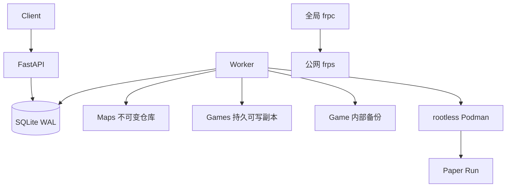

# Minecraft 小游戏管理后端设计与部署

## 1. 架构结论

后端运行在 Windows 的 WSL2 Ubuntu 中：

- Python 3.12 项目内 venv；
- FastAPI 负责 HTTP API；
- 单 Worker 执行地图复制、Paper 下载、Podman 启停和备份；
- SQLite WAL 保存资源、任务、端口租约和状态机；
- 每次运行使用一个 rootless Podman 容器；
- 一个全局 frpc 静态注册全部端口池；
- systemd 管理 API、Worker 和 frpc；
- 数据全部位于 WSL ext4，不放在 `/mnt/c`。



## 2. 领域模型

### Map

Map 是仓库中的不可变原始地图，类似容器 image：

- 只使用 `map_id`；
- 上传成功后不再修改内容；
- 保存 Minecraft 版本、DataVersion、Paper build、Java 主版本和制品校验信息；
- 一个 Map 可以创建任意多个互相独立的 Game。

### Game

Game 是从 Map 创建出的持久可玩副本，类似 container 的持久工作区：

- 只使用 `game_id`；
- 通过 `map_id` 记录来源 Map；
- 创建 Game 只复制地图并进入可启动列表，不会启动 Paper、占用端口或连接 frp；
- 同一个 Game 可以反复启动和停止；
- 同一个 Game 同时最多有一个非终态 Run。

Map 与 Game 使用不同 ID 空间。数值偶然相同也不代表同一个资源，因为它们属于不同表和 API。

### Run

Run 是 Game 的一次临时运行：

- 使用内部 `run_id`；
- 持有 Podman 容器、端口、generation 和运行状态；
- API 不返回 `run_id`；
- Game 停止后 Run 进入历史状态，但 Game 及进度继续存在。

### Backup

Backup 是 Game 内部的有限线性时间线：

- 使用 UTC 微秒时间型 `backup_id`；
- 唯一键为 `(game_id, backup_id)`；
- backup 没有 `map_id` 或 `game_id` 之外的顶级身份；
- 默认每次正常停止创建一个备份；
- 加载备份前先创建当前状态的保护备份；
- 新备份提交成功后才异步回收窗口外旧文件。

### Task

Task 是耗时操作的取件码：

- 使用 `task_id`；
- 类型包括创建 Game、删除 Game、启动、停止和加载备份；
- 状态为 `pending → running → succeeded | failed | canceled`；
- API 通过 Task 返回当前步骤、进度、结果和脱敏错误；
- 创建命令支持 `Idempotency-Key`，用于安全重试。

## 3. 为什么只借鉴 Docker，而不直接使用 OCI layer 保存世界

概念映射如下：

| 系统对象 | 容器类比 | 实际实现 |
|---|---|---|
| Map | image | 不可变普通目录 |
| Game | container workspace/volume | Podman 外部持久目录 |
| Run | container process | rootless Podman 容器 |
| Backup | snapshot | 独立可校验恢复点 |
| Task | engine job | SQLite 持久任务 |

世界数据通过 bind mount 挂载到 `/data`，不写进容器 writable layer。因此容器可以随时删除和重建，不影响 Game。`podman commit` 不包含 bind mount，OCI layer 的 tar/whiteout 模型也不适合频繁修改的 Minecraft region 文件。

当前 WSL 数据盘是 ext4，不支持 reflink。存储演进路线是：

1. 当前使用完整目录复制，优先保证一致性；
2. 抽象 ActiveStore/BackupStore；
3. 引入 restic 风格内容寻址分块和异机副本；
4. 如需更低停服时间，再挂载独立 Btrfs VHDX，以子卷快照加速本地备份和恢复；
5. OverlayFS 只考虑用于延迟创建 Game，不作为备份格式，因为 `.mca` 文件首次写入可能整文件 copy-up。

物理存储可以使用增量图，但 API 始终保持 Game 内部的线性 Backup，不开放任意分支树。

## 4. API

所有接口使用 `/api`，暂不增加版本前缀。生产环境发送：

```http
Authorization: Bearer <MC_API_TOKEN>
```

创建或命令请求建议发送：

```http
Idempotency-Key: <客户端生成的唯一值>
```

### Map API

- `GET /api/maps`：列出全部可用仓库地图。
- `POST /api/maps`：multipart 上传 `map.zip`、资源和版本元数据，创建 Map。
- `GET /api/maps/{map_id}`：查询指定 Map。
- `DELETE /api/maps/{map_id}`：删除没有关联 Game 的 Map。

上传字段：

- `map` 或 `map.zip`：地图压缩包；
- `name`：名称；
- `mc_version`：精确 Minecraft 版本；
- `paper_build`：固定 Paper build；
- `java_major`：Java 主版本，默认 17；
- `paper_url` 与 `paper_sha256`：可选的成对自定义制品；
- 其他文件字段：随地图保存的资源文件。

### Game API

- `GET /api/games`：列出全部持久 Game。
- `POST /api/games`：根据 JSON 中的 `map_id` 创建 Game，但不启动。
- `GET /api/games/{game_id}`：查询 Game、来源 Map、准备状态和最近运行状态。
- `DELETE /api/games/{game_id}`：异步删除已经停止的 Game 及其 Backup。

创建请求：

```json
{
  "map_id": 123,
  "name": "可选的本局名称"
}
```

返回 HTTP 202：

```json
{
  "task_id": "uuid",
  "game_id": 456,
  "map_id": 123,
  "status": "pending"
}
```

### 运行命令

- `POST /api/start`：启动已有 Game。
- `POST /api/stop`：停止 Game，成功停止后自动备份。
- `POST /api/load`：保护当前状态后，将 Backup 原地加载回同一个 Game。

启动请求：

```json
{
  "game_id": 456,
  "port": 30001
}
```

`port` 可省略，由端口池分配。返回 `task_id`、`game_id`、分配端口和状态，不公开内部 `run_id`。

停止请求：

```json
{
  "game_id": 456
}
```

加载请求：

```json
{
  "game_id": 456,
  "backup_id": "20260831T170000123456Z"
}
```

### Backup API

- `GET /api/games/{game_id}/backups`：列出 Game 的内部备份。
- `DELETE /api/games/{game_id}/backups/{backup_id}`：逻辑删除备份，文件由 Worker 回收。

### Task 与状态

- `GET /api/tasks/{task_id}`：查询任务步骤、进度、结果或错误。
- `GET /api/status`：查询运行中的 Game、最近 Task 和端口池。
- `GET /healthz`：不鉴权的本机健康检查。

没有 `/api/list`、`/api/operations`、按端口 stop 或混合 Map/Game 的 start。GET/DELETE 的资源 ID 放 URL；业务命令参数统一放 JSON。

错误格式：

```json
{
  "error": {
    "code": "game_not_found",
    "message": "游戏不存在",
    "details": {}
  }
}
```

## 5. 工作流

### 创建 Game

1. API 验证 Map 并预分配 `game_id` 与 `task_id`；
2. Worker 将不可变 Map 复制到 staging；
3. 校验后原子发布到 Game 目录；
4. Game 进入 `ready`；
5. 不启动容器，不分配端口。

### 启动 Game

1. 验证 Game 为 `ready` 且没有其他任务或运行；
2. 创建内部 Run；
3. 在 SQLite 短事务中预留端口并递增 generation；
4. 固定 Paper build、SHA-256 与 Java 镜像；
5. 下载并校验缺失的 Paper JAR；
6. rootless Podman 创建容器，将 Game 挂载到 `/data`；
7. 等待 Paper 日志 `Done (` 且 TCP 端口可连接；
8. 标记 Run ready、端口 active、Task succeeded。

### 停止 Game

1. 向 Paper 容器 PID 1 发送 SIGTERM；
2. 最多等待 120 秒自然退出；
3. 超时则 SIGKILL，并将备份标记为不干净；
4. 在 staging 创建完整 Backup 并校验；
5. 提交 Backup 和 Task；
6. 释放匹配 `run_id + generation` 的端口；
7. 回收超出上限的旧 Backup。

### 加载 Backup

1. 独占锁定 Game；
2. 如在运行则先停止；
3. 创建 `before_restore` 保护备份；
4. 校验目标 Backup；
5. 恢复到 staging；
6. 原子替换 Game 目录；
7. `game_id` 保持不变；
8. 加载完成后由客户端重新调用 start。

## 6. 数据库与恢复

最终表：

- `maps`
- `games`
- `backups`
- `runs`
- `tasks`
- `port_leases`

关键约束：

- `games.map_id` 外键指向 Map，存在 Game 时拒绝删除 Map；
- 每个 Game 同时最多一个非终态 Run；
- 每个 Run 同时最多一个 pending/running stop Task；
- 每个端口最多绑定一个 Run；
- `(game_id, backup_id)` 唯一；
- `Idempotency-Key` 全局唯一。

Alembic `20260831_0002` 可迁移旧的混合 Map/active 数据：旧 repository 行进入 `maps`，旧 active 行进入 `games`，旧 instance/operation 分别进入内部 `runs` 和公开 `tasks`。旧物理 `repository/active` 路径仍受 systemd 过渡权限支持；所有新资源使用 `maps/games`。

Worker 启动时：

- 单机进程锁阻止第二个 Worker；
- 所有旧 `running` Task 立即回到 pending；
- Game 锁保留到对应 Task 成功或失败，不因容器缺失提前解锁；
- 对账数据库 Run 与 Podman 容器；
- 释放确认不存在的 Run 的端口；
- 恢复中断的目录替换；
- 回收备份垃圾和无引用目录。

## 7. 目录与权限

```text
/srv/mc-manager/
├── maps/<map_id>/
├── games/<game_id>/
├── backups/<game_id>/<backup_id>/
├── artifacts/paper/<sha256>.jar
├── uploads/
└── .staging/
    ├── api/
    └── worker/
```

- API 用户可写 `maps`、`uploads` 和 API staging；
- Worker 可读 `maps`，可写 `games`、`backups`、`artifacts` 和 Worker staging；
- Paper 容器只读挂载 JAR、读写挂载一个 Game；
- Map 不挂载给 Paper；
- Backup 不挂载给 Paper；
- SQLite 位于 `/var/lib/mc-manager`，API 与 Worker 通过受限共享组访问。

## 8. Paper、Java 与 Podman

Java 主版本映射到固定容器镜像。SDKMAN 只适合管理员在交互式开发环境中测试 JDK，不参与 systemd 生产启动，因为其 shell 初始化、可变 candidate 和共享宿主环境不具备容器镜像的可复现性与隔离性。

Podman 容器使用：

- rootless 系统用户；
- 独立 subuid/subgid；
- `cap-drop=ALL`；
- `no-new-privileges`；
- 只读容器根；
- 临时 `/tmp`；
- CPU、内存和 PID 限制；
- 仅绑定 `127.0.0.1:<port>`；
- restart policy `no`。

当前 registry 配置优先 DaoCloud、再尝试 1ms、最后访问 Docker Hub。USTC Docker Hub 缓存已暂停。生产镜像应固定 digest。

## 9. frpc

frpc 0.68.0 作为单个 systemd 服务运行，并静态注册整个端口池：

```text
frps:30000 → frpc → WSL 127.0.0.1:30000 → Paper:25565
```

启动和停止 Game 不修改 frpc 配置。只有管理员调整整个端口池时才验证并 reload。`remotePort` 位于 frps 主机，必须同时配置 frps `allowPorts`、操作系统防火墙和云安全组。

当前 frpc 已安装并通过模板校验，但保持 disabled/inactive；填写真实 frps 地址与 `/etc/frp/client_token` 后再启用。

## 10. WSL 部署

启用 systemd 后执行：

```bash
sudo bash scripts/install-wsl.sh
```

脚本安装 Python venv、rootless Podman 组件和固定校验的 frpc，创建服务账户、subuid/subgid、目录、随机 API token 和 systemd 单元。

配置：

- `/etc/mc-manager/mc-manager.env`
- `/etc/frp/frpc.toml`
- `/etc/frp/client_token`

启用 API 与 Worker：

```bash
sudo systemctl enable --now mc-manager-api mc-manager-worker
```

frps 配置完成后：

```bash
sudo systemctl enable --now frpc
```

常用检查：

```bash
systemctl status mc-manager-api mc-manager-worker frpc
journalctl -u mc-manager-api -f
journalctl -u mc-manager-worker -f
curl http://127.0.0.1:8080/healthz
```

Windows 还需使用任务计划程序在无人登录的冷启动时唤醒指定 WSL 发行版。

## 11. 当前验证状态

已验证：

- 完整 pytest 流程；
- Ruff 与 mypy；
- Alembic 空库与 0001 非空迁移；
- ORM 与 migration schema 一致；
- rootless Podman Worker systemd 沙箱；
- Temurin Java 17 镜像运行；
- PaperMC v3 精确 build 元数据查询；
- frpc 0.68.0 配置校验；
- API Bearer 鉴权、健康检查及 systemd 启动。

尚需在真实地图和公网 frps 环境验收：Paper 完整启动、玩家连接、正常 SIGTERM 存档、frp 公网端口和 Windows 冷启动恢复。
